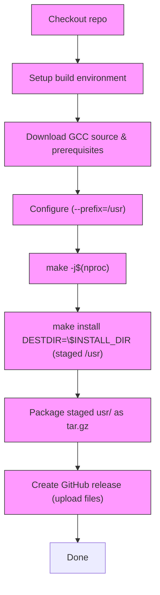

# paran-base

## Release pipeline (GitHub Actions)

The `release` workflow builds and packages GCC into a canonical `usr/` staging
tree and uploads the archive as a GitHub release. High-level flow:

Notes:
- The workflow now configures GCC with `--prefix=/usr` and uses `DESTDIR` to
  stage the installation under `$WORKDIR/gcc-install/usr`.
- The produced archive contains a `usr/` tree; use `scripts/install-gcc-from-dir.sh`
  (it now auto-detects and accepts a staged `usr/` layout) to install on target
  systems such as Paran OS.
