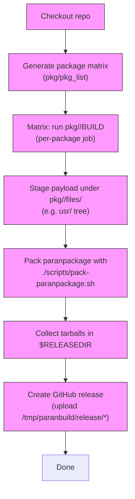

# paran-base

## Release pipeline (GitHub Actions)

The `release` workflow is modular and package-driven. It reads `pkg/pkg_list`,
builds each package listed there (one matrix job per package), packs the
package with `./scripts/pack-paranpackage.sh`, and publishes a single GitHub
release containing all produced paranpackage tarballs.

Quick overview
- Matrix generation: the workflow reads `pkg/pkg_list` and creates a build
  matrix entry for each package.


```mermaid
flowchart TD
  Checkout["Checkout repo"] --> Matrix["Generate package matrix\n(pkg/pkg_list)"]
  Matrix --> Build["Matrix: run pkg/<name>/BUILD\n(per-package job)"]
  Build --> Stage["Stage payload under pkg/<name>/files/\n(e.g. usr/ tree)"]
  Stage --> Pack["Pack paranpackage with\n./scripts/pack-paranpackage.sh"]
  Pack --> Collect["Collect tarballs in $RELEASEDIR"]
  Collect --> Release["Create GitHub release\n(upload /tmp/paranbuild/release/*)"]
  Release --> Done["Done"]

  classDef step fill:#f9f,stroke:#333,stroke-width:1px;
  class Checkout,Matrix,Build,Stage,Pack,Collect,Release step;
```
- Per-package build: for each package the runner calls `pkg/<name>/BUILD`
  with arguments `WORKDIR SOURCE_OR_VERSION RELEASE_TAG`. `BUILD` should
  stage the package payload under `pkg/<name>/files/` (for example a `usr/`
  tree for prebuilt binaries).
- Packing: the workflow runs `./scripts/pack-paranpackage.sh pkg/<name> <out>` to
  produce a valid paranpackage tarball that includes `MANIFEST`, scripts,
  helpers and the `files/` payload.
- Release: the workflow publishes a single GitHub release for the tag and
  uploads the entire release directory glob (e.g. `/tmp/paranbuild/release/*`).

pkg_list format
- File: `pkg/pkg_list`
- Each non-empty, non-comment line is a whitespace-separated entry where the
  first token is the package name (directory under `pkg/`) and the second
  token is an optional source identifier (either a version like `14.1.0` or a
  full tarball URL). Additional tokens are accepted but currently ignored by
  default.

Example `pkg/pkg_list`:

```
gcc 14.1.0
mypkg https://example.com/mypkg-1.2.3.tar.gz
```

`pkg/*/BUILD` contract
- Signature: `BUILD WORKDIR SOURCE_OR_VERSION RELEASE_TAG`
- Responsibility: download/build or stage artifacts and place the final
  payload under `pkg/<name>/files/`. Do NOT create the final paranpackage
  tarball; the repository packer will do that.

Local testing
- Build and stage a package locally (example for `gcc`):

```bash
# run BUILD to produce pkg/gcc/files/usr/
cd pkg/gcc
./BUILD /tmp/paranbuild 14.1.0 v0.0.1

# from repo root, create paranpackage tarball
./scripts/pack-paranpackage.sh pkg/gcc /tmp/paranbuild/release/gcc-v0.0.1.tar.gz

# optionally add and install with the local pp binary
./temp/pp/pp a gcc 14.1.0 /tmp/paranbuild/release/gcc-v0.0.1.tar.gz <sha256>
./temp/pp/pp i gcc
./temp/pp/pp r gcc
```

Adding a new package
1. Create `pkg/<name>/` containing `MANIFEST`, `install.sh`, `uninstall.sh`,
   and a `BUILD` helper that follows the contract above.
2. Add a line to `pkg/pkg_list` with the package name and optional source.